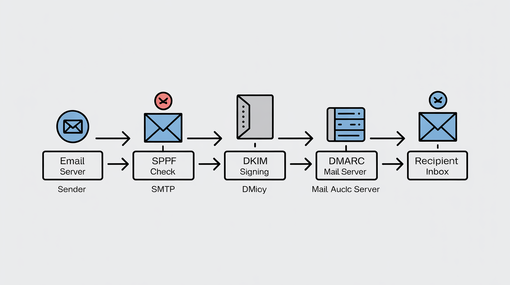

# Architecture Diagrams

This folder contains architecture diagrams used in the Email Authentication Audit Toolkit documentation.

These diagrams illustrate the flow of email authentication checks performed by receiving mail servers.

---

## Email Authentication Flow

The following diagram shows how email authentication mechanisms work together:

1. Email is sent by the sender
2. The receiving SMTP server performs an SPF validation
3. The message is verified using the DKIM signature
4. The DMARC policy is evaluated
5. The email is delivered to the recipient inbox if authentication succeeds

---

## Components Explained

| Component | Description |
|----------|-------------|
| Email Sender | Originating mail system sending the email |
| SMTP Server | Server responsible for receiving the message |
| SPF Check | Verifies sending server is authorized |
| DKIM Signing | Validates cryptographic signature |
| DMARC Policy | Applies domain authentication policy |
| Recipient Mail Server | Destination mail system |
| Inbox | Final delivery location |

---

## Usage

These diagrams are referenced in the main repository documentation to visually explain email authentication processes.

They can be embedded in Markdown using:

---

## Source

Diagram generated for documentation purposes using AI-assisted diagram generation tools.
